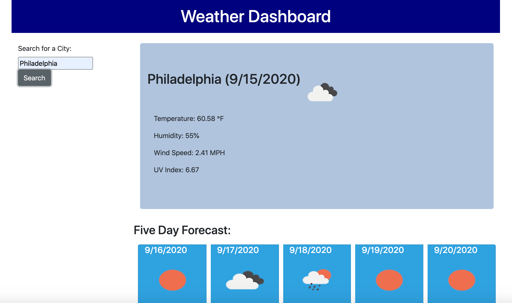

# Weather Dashboard

</>

For this project, I've created a weather dashboard application that allows the user to search weather information by city. I used 2 APIs to retrieve current/future weather and corresponding dates. When the user enters a city and clicks the search button, they are presented with a snapshot of current weather information along with an icon to indicate weather conditions. Additionally, they receive a 5 day forecast that includes the date, temperature, humidity, and a weather icon. Technolgies used include Bootstrap, JavaScript, JQuery, and Open Weather Map.

https://jeniglar.github.io/WeatherDashboard/

jeniglar@gmail.com
